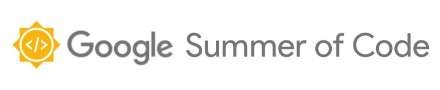
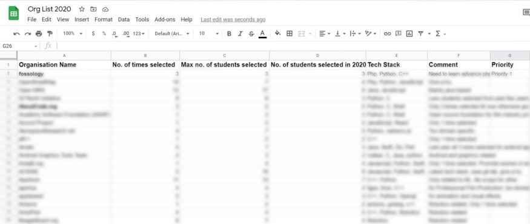

# Pre-GSoC journey

## What is Google Summer of Code (GSoC)?

According to the [official website](https://summerofcode.withgoogle.com/), Google Summer of Code is a global program focused on bringing more student developers into open source software development. Students work with an open-source organization on a 10-week programming project during their break from school.

GSoC is not an internship and should not be considered as a way to earn money. Instead, its main aim is to bring more developers to contribute to open-source projects (even after the GSoC period ends).

## Why GSoC?

- The pride in the feeling that your code will cause an impact in the lives of millions of people who will use it is unparalleled
- Incredible learning experience
- Building your network with amazing connections
- Opportunity to write modular, scalable, well-tested, and documented production-level code
- The stipend and the fame

  

## How to start contributing to open-source?

- Find your passion (Web development, Android development, Machine Learning, Cyber Security, Internet of things, etc.)
- Understand basics of any Object-Oriented Programming Language
- Learn to use a Version Control System like Git and a code hosting platform for version control like GitHub or GitLab
- Choose the project which excites you the most and then learn anything and everything that is required in the process.

## Prerequisite?

- Eagerness to learn something new every day
- Can devote enough time to this program along with studies (preparation time before the GSoC period is crucial)

  

## How to select the organization?

Choose the organization/project matching your skillset from the organization list.

**[GSoC organization List](https://summerofcode.withgoogle.com/organizations)**

Use **[gsocanalyzer](https://sparsh1212.github.io/gsocanalyzer/)** to research more about the organization

**You can make a sheet like this to ensure you did the research pretty well**

  

## How to interact with the organization?

1. Research about the organization (What they do?)

2. Join the organization communication group (IRC Channel, Gitter, Slack, Zulip, Mailing list, etc.)

3. Familiarize yourself with the platform used for code review by that organization (GitHub, GitLab, Phabricator, etc.)

4. Explore the projects of that organization. (The problem that it needs to solve, the tech stack of the project and the good first issues)

5. Find out who are the project/organization admins, maintainers, regular contributors (you must know whom to ask for help)

6. Run the project locally (One of the most important step, as most people give up here if they face some issue)

7. Try using the software/product and find a scope of improvement in it

8. Open new issues or ask to work on any open good first issue

  - Do not randomly tag any mentor
  - Before opening a new issue check if a similar issue exists
  - Check if someone else is working on it or is assigned that task
  - Check for incorrect grammar or spelling mistakes before sending anymessage/email

:::tip TIP
  Using Grammarly is a must!
:::

## The most important part!!!

  

## Understanding the codebase

Understanding the codebase is always overwhelming, * **but remember that Rome was not built in a day** *. Try to understand the workflow of code, execution starts at which file, which files and folders are responsible for which program logic. By doing this one can quickly get a high-level overview of the program logic and workflow.

## Before your first pull request (PR)

1. Read about the code style guide and understand the coding convention followed (when to use camel case, pascal case, 2 space or 4 space indentation, etc.)
2. Check if any code formatting tools or linters are used
3. Understand the automated tests that run on every pull request
4. Understand basics of git like how to add Developer Certificate of Origin, squashing commits, rebasing branches, resolving merge conflicts, etc.

  

## How did I start with FOSSology?

After making a list of 200+ organizations, I ended up focusing on 3 of them according to my skillset and the interesting projects they had which I can contribute to as a beginner. And finally, I narrowed it to a single organization FOSSology.

I was fortunate enough to be a part of the HypnOS community where the mentors guide how to start with open-source and help you in every way possible to clear your queries.

That's when I started contributing to FOSSology in December 2020. The mentors were very helpful and supportive. Soon after setting up the project locally, I started exploring it and realized that I have to learn new programming languages and frameworks.

  

> Quite overwhelming right? But trust me it's more difficult to reach from level 0 to level 1 than from level 1 to level 10.

Every day I thought of giving up but guess what I tried and tried, asked for guidance, and made it through. It was all worth it!

Before the GSoC period, I made 18 pull requests in FOSSology out of which 17 are merged and 1 is in the review process. It won't be possible without the support and guidance I received at every stage from the fossology community.

Each day I learned something new and exciting. I ended up learning 4 new programming languages (PHP, Python, C++, and Typescript), 2 new frameworks (Angular and Symfony), and a prototyping tool (Figma) while contributing to this project in just 5 months.

:::tip Fun Fact
During the GSoC period I have to write code mainly in JavaScript and React 😜
:::

## About my project: Adding React library to new UI
FOSSology frontend is built using the Symfony framework of PHP. It needs to get revamped to make it faster for development, more adaptive to newer technologies, and impart a modernized look. I would rewrite the UI in React from scratch while ensuring a **highly scalable**, **flexible**, and **easy to use and maintain** code architecture. Also, I will be upgrading the existing API and would integrate it with the new frontend code.

**Deliverables** of this project:
- A fresh modern look to the FOSSology UI
- Complete migration of frontend to React
- Upgradation of API to provide more functionalities
- Documentation of frontend code

**[Project Proposal Link](https://docs.google.com/document/d/190Mo7QkR3DD8pVpS71uhzVWBkD0rTqxSCyu8k6hv5K0/edit?usp=sharing)**

## What next?

Time to give back to the community and support HypnOS.

  

